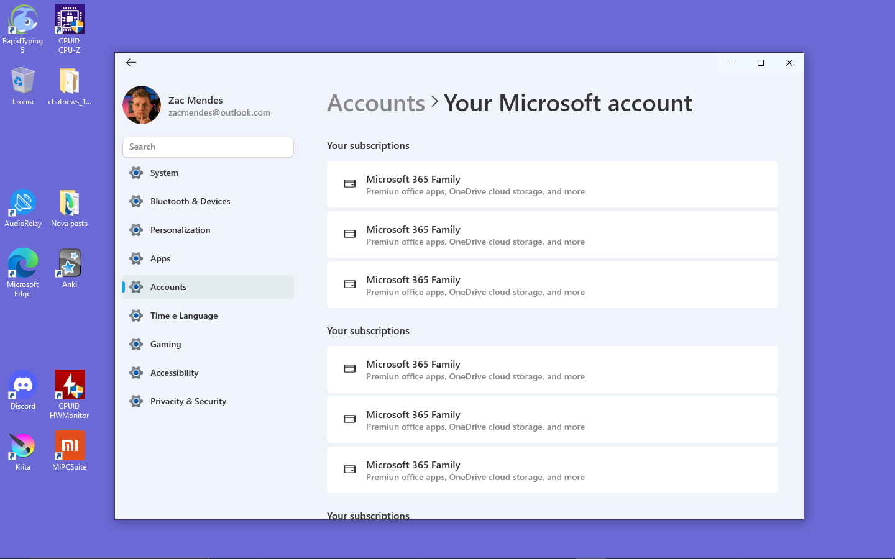

<h1 align="center">
  
</h1>

  

 

 

## ✨Technologies

This project was developed using the following technologies:

- [react-native](https://reactnative.dev/)
- [react-native-windows](https://microsoft.github.io/react-native-windows/)
- [TypeScript](https://www.typescriptlang.org/)
- [@react-navigation](https://reactnavigation.org/)

## 💻 Project

The Settings clone is a study app, replicating as closely as possible the functionalities of the original application with the aim of providing applications with a better interactive experience to Windows clients.

## 🚀 How to Run

Clone the repository
- Install the dependencies with `yarn`
- Start the fake API with `yarn windows`
- Start the server with `yarn start`
- 
## 📄 License

Made with ♥ by Victor0814gui
